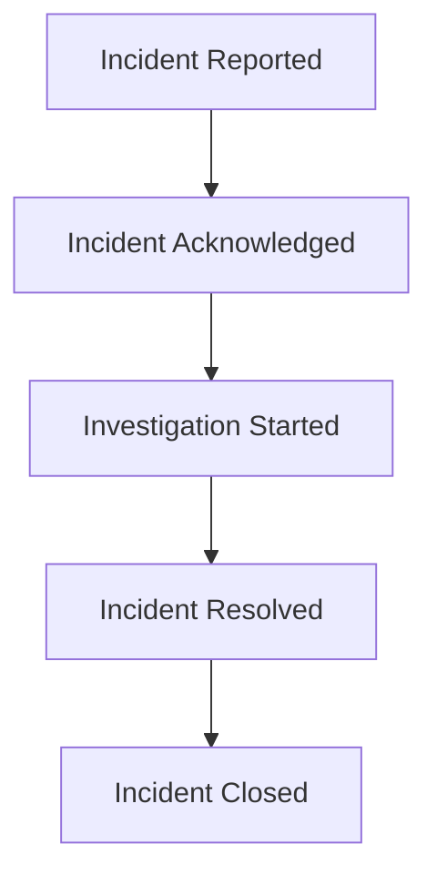
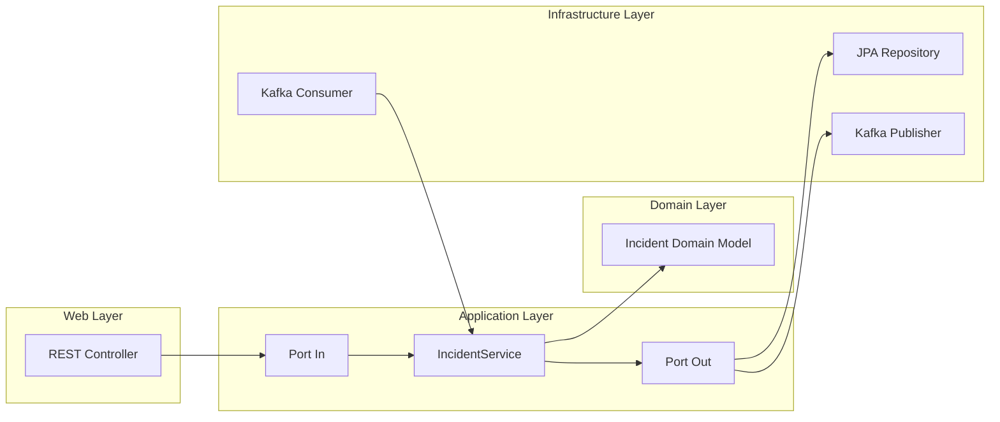

# 🚨 EVENTRA – Enterprise Incident Orchestration Platform

A modular monolith backend system for orchestrating enterprise incidents using **Spring Boot**, **Kafka**, and **Clean Architecture**. Designed for asynchronous workflows, domain-driven design, and scalable event handling.

---

## 🧱 Module Structure

```
eventra-incident/
└── src/
    └── main/
        ├── java/com/eventra/incident/
        │   ├── adapter/in/web              ← REST Controllers
        │   ├── adapter/out/jpa             ← JPA Repositories & Entities
        │   ├── application/port/in         ← Service Interfaces
        │   ├── application/port/out        ← Repository Interfaces
        │   ├── application/service         ← Business Logic
        │   ├── domain                      ← Domain Models
        │   ├── messaging/publisher         ← Kafka Publisher
        │   ├── messaging/consumer          ← Kafka Consumer
        │   ├── validator                   ← Request Validators
        │   └── mapper                      ← MapStruct Mappers
        └── resources/
            └── application.yml
```

> 🧼 Follows **Hexagonal Architecture** — isolating core logic from delivery and infrastructure.

---

## 🔄 Incident Lifecycle (Kafka Events)

```
REPORTED → ACKNOWLEDGED → INVESTIGATING → RESOLVED → CLOSED
```

Each stage is triggered via **Kafka domain events**, enabling asynchronous communication between modules.

---

## 🧩 Key Components

| Component                  | Purpose                                       |
|---------------------------|-----------------------------------------------|
| `IncidentEvent`            | Tracks incident lifecycle in DB               |
| `IncidentRepository`       | Access to incident history                    |
| `IncidentKafkaConfig`      | Kafka consumer setup                          |
| `IncidentService`          | Core business logic                           |
| `IncidentEventListener`    | Consumes `IncidentReportedEvent`              |
| `IncidentEventFactory`     | Creates `IncidentResolvedEvent`               |
| `IncidentController`       | REST API for incident operations              |

---

## 🐳 Docker-Based Dev Setup

```bash
# Make scripts executable
chmod +x eventra-*/wait-for-mysql.sh

# Build artifacts
mvn clean package -DskipTests

# Start services
docker compose up -d --build
```

---

## ⚡ Quick Start

```bash
# 1️⃣ Clone the repo
git clone https://github.com/Shubh00796/EVENTRA-ENTERPRICE_INCIDENT_ORCHESTRATION_PLATFORM.git
cd EVENTRA-ENTERPRICE_INCIDENT_ORCHESTRATION_PLATFORM

# 2️⃣ Build & boot services
mvn clean package -DskipTests
docker compose up -d --build

# 3️⃣ Report an incident
curl -X POST http://localhost:8081/api/incidents \
     -H 'Content-Type: application/json' \
     -d '{"title":"Database outage","severity":"HIGH"}'
```

---

## 📚 References

- 📘 [Event-Driven Architecture – Martin Fowler](https://martinfowler.com/articles/201701-event-driven.html)
- 📘 [Apache Kafka Documentation](https://kafka.apache.org/documentation/)

---

## 🤝 Contributing

We welcome your ideas and PRs! 🚀

```bash
# Fork + branch
git checkout -b feature/my-feature

# Commit & push changes
git commit -m "Add feature"
git push origin feature/my-feature

# Open a pull request
```

For major changes, open an issue first to discuss your proposal.

---

## 🙌 Support & Feedback

Found this useful?  
⭐ Star the repo or open an issue with suggestions.

---
# 🚨 EVENTRA – Enterprise Incident Orchestration Platform

A modular monolith backend system for orchestrating enterprise incidents using **Spring Boot**, **Kafka**, and **Clean Architecture**. Designed for asynchronous workflows, domain-driven design, and scalable event handling.

---

## 🧱 Project Structure

```
EVENTRA/
├── EVMP/                  ← Core orchestration logic
├── core/                  ← Shared utilities and base abstractions
├── incident/              ← Incident lifecycle management
├── notification/          ← Email & alerting pipeline
└── EvmpApplication.java   ← Spring Boot entry point
```

Each module is self-contained and follows **hexagonal architecture**, ensuring separation of concerns and testability.

---

## 📦 Incident Module Breakdown

```
incident/
└── src/
    └── main/
        ├── java/com/eventra/incident/
        │   ├── adapter/in/web              ← REST Controllers (HTTP layer)
        │   ├── adapter/out/jpa             ← JPA Repositories & Entities
        │   ├── application/port/in         ← Use-case interfaces (driven ports)
        │   ├── application/port/out        ← Persistence interfaces (driving ports)
        │   ├── application/service         ← Business logic implementation
        │   ├── domain                      ← Core domain models (Incident, Status)
        │   ├── messaging/publisher         ← Kafka producers (event emitters)
        │   ├── messaging/consumer          ← Kafka consumers (event listeners)
        │   ├── validator                   ← Request validation logic
        │   └── mapper                      ← MapStruct DTO ↔ Entity mappers
        └── resources/
            └── application.yml             ← Spring Boot config
```

### 🧠 Folder Insights

- **adapter/in/web**: Exposes REST endpoints for incident operations.
- **adapter/out/jpa**: Contains JPA entities and repositories for persistence.
- **application/port/in**: Defines service contracts for use cases.
- **application/port/out**: Abstracts data access and external dependencies.
- **application/service**: Implements business rules and orchestrates flows.
- **domain**: Pure domain objects with no framework dependencies.
- **messaging/publisher**: Publishes domain events to Kafka topics.
- **messaging/consumer**: Subscribes to Kafka topics and triggers workflows.
- **validator**: Validates incoming requests using custom annotations or logic.
- **mapper**: Uses MapStruct to convert between DTOs and entities.

---

## 🔄 Incident Lifecycle (Kafka Event Flow)



Each transition is triggered by a **Kafka domain event**, enabling asynchronous communication between services.

---

## 🧬 Architecture Overview



> 🧼 Clean Architecture ensures that business logic is isolated from frameworks and delivery mechanisms.

---

## 🐳 Docker-Based Dev Setup

```bash
# Make scripts executable
chmod +x eventra-*/wait-for-mysql.sh

# Build artifacts
mvn clean package -DskipTests

# Start services
docker compose up -d --build
```

---

## ⚡ Quick Start

```bash
# 1️⃣ Clone the repo
git clone https://github.com/Shubh00796/EVENTRA-ENTERPRICE_INCIDENT_ORCHESTRATION_PLATFORM.git
cd EVENTRA-ENTERPRICE_INCIDENT_ORCHESTRATION_PLATFORM

# 2️⃣ Build & boot services
mvn clean package -DskipTests
docker compose up -d --build

# 3️⃣ Report an incident
curl -X POST http://localhost:8081/api/incidents \
     -H 'Content-Type: application/json' \
     -d '{"title":"Database outage","severity":"HIGH"}'
```

---

## 📚 References

- 📘 [Event-Driven Architecture – Martin Fowler](https://martinfowler.com/articles/201701-event-driven.html)
- 📘 [Apache Kafka Documentation](https://kafka.apache.org/documentation/)
- 📘 [Hexagonal Architecture – Alistair Cockburn](https://alistair.cockburn.us/hexagonal-architecture/)

---

## 🤝 Contributing

We welcome your ideas and PRs! 🚀

```bash
# Fork + branch
git checkout -b feature/my-feature

# Commit & push changes
git commit -m "Add feature"
git push origin feature/my-feature

# Open a pull request
```

For major changes, open an issue first to discuss your proposal.

---

## 🙌 Support & Feedback

Found this useful?  
⭐ Star the repo or open an issue with suggestions.

---
